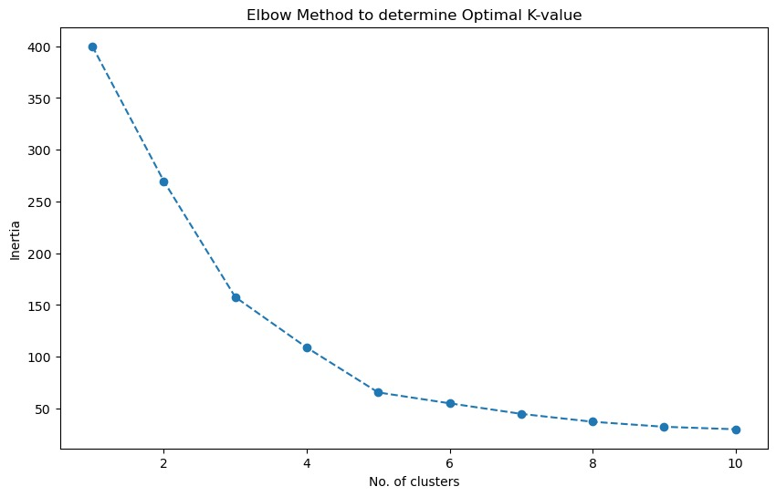
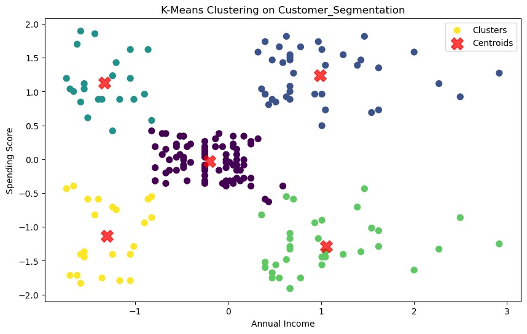
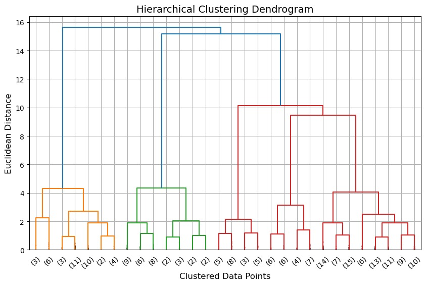
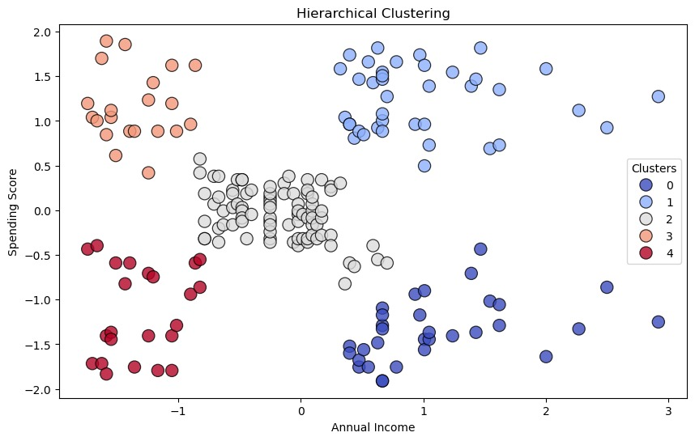

# Customer Segmentation using Machine Learning 🚀📊

Welcome to the *Customer Segmentation using Machine Learning* project! This initiative focuses on segmenting customers based on their purchasing behavior, using clustering techniques like *K-Means* and *Hierarchical Clustering*.

---

## 📝 Table of Contents

- [About the Project](#about-the-project)
- [Key Features](#key-features)
- [Dataset](#dataset)
- [Technologies Used](#technologies-used)
- [Getting Started](#getting-started)
- [Results](#results)
- [Output Visualizations](#output-visualizations)
- [Contributing](#contributing)
- [License](#license)

---

## About the Project 📚

The *Customer Segmentation* project applies machine learning techniques to cluster customers based on their *Annual Income* and *Spending Score*. Through this project, we aim to:

- Perform *data preprocessing* and scaling.
- Apply *K-Means Clustering* and determine the optimal *K* using the *Elbow Method*.
- Apply *Hierarchical Clustering* and analyze the *Dendrogram*.
- Visualize clusters to uncover meaningful *customer segments*.

---

## Key Features 🎯

- *Data Exploration*: Understand customer spending habits and income groups.
- *Visualization*: Interactive visualizations for better insights.
- *Machine Learning Models*: K-Means and Hierarchical Clustering for segmentation.
- *Business Insights*: Practical recommendations for marketing strategies.

---

## Dataset 📂

The dataset, *Mall_Customers.csv*, contains customer information such as:
- *Customer ID*
- *Age*
- *Gender*
- *Annual Income*
- *Spending Score*

---

## Technologies Used 🛠️

- *Programming Language*: Python
- *Libraries*: NumPy, Pandas, Matplotlib, Seaborn, Scikit-learn
- *Tools*: Jupyter Notebook

---

## Getting Started 🚀

### Prerequisites
- Python 3.8 or higher
- Required libraries installed (pip install -r requirements.txt)

## 🚀 Running the Code
1. Clone this repository:
   git clone https://github.com/CodeBenderrr/Customer_Segmentation-ML.git

2. Install dependencies:
   pip install -r requirements.txt

3. Run the script:
   python src/clustering.py

## 📌 Results
Our analysis yielded the following insights:

Optimal Clusters: The Elbow Method determined the best number of clusters for segmentation.
Customer Segments: Clear groups of customers based on income and spending habits.
Model Evaluation: The clustering models successfully segmented customers for targeted marketing.

## 📸 Visualizations
*1. Elbow Method for KMeans*  

*2. K-Means Clustering*  

*3. Dendrogram for Hierarchical Clustering*  

*4. Hierarchical Clustering*  

### Contributing
We welcome contributions from everyone! To learn how you can contribute, please see our [Contributing Guidelines](CONTRIBUTING.md).

### Code of Conduct
Please note that we have a [Code of Conduct](CODE_OF_CONDUCT.md) in place to ensure that all participants can contribute in a respectful and welcoming environment.

### License 📜
This project is licensed under the MIT License. See the [LICENSE](LICENSE) file for details.
